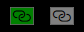
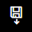
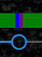
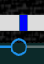
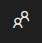
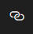
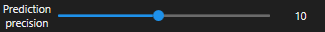
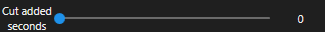

# Tutorial

## Noise specific functionality

| Button                                                             | Functionality                                                                                                                            |
| ------------------------------------------------------------------ | ---------------------------------------------------------------------------------------------------------------------------------------- |
|                   | Starts noise detection. If the recognition model is used, the app will first need to load it to memory. That happens once per app start. |
|  | Starts noise detection in every video in playlist.                                                                                       |
|                       | Links the end of the video to another video. If it's green, it has been linked.                                                          |
|                   | Splits the video into the /split folder where the file is.                                                                               |
|     | Splits all videos in playlist.                                                                                                           |

__IMPORTANT:__ Prediction will automatically check if:

* a video file which is a numerical successor exists, then
* the first and last frame look similar
  
If both are true - it will link the file automatically.

### Timeline

Shows the timeline with the possibility to adjust the length of split video, by dragging the pegs.

| Peg                                               | Description                                                                                    |
| ------------------------------------------------- | ---------------------------------------------------------------------------------------------- |
|  | Drag a part's peg to modify it.  Parts can't overlap other parts.                              |
|  | Shorten it to the minimum - when the peg turns red, mouse up will remove that part.            |
|     | Double Click a white Timeline space to create a new video part. Prediction didn't have to run. |

## Settings

| Setting                                                     | Description                                                                                                                                     |
| ----------------------------------------------------------- | ----------------------------------------------------------------------------------------------------------------------------------------------- |
|     | Use similiarity instead of Noise prediction model. Useful if the model has a problem with your recordings (send a video in to extend the model) |
|        | Don't automatically link the next video                                                                                                         |
|  | How many seconds should the prediction method jump over with each step. The higher, the faster, but the higher chance to jump over noise.       |
|         | How many seconds to add before and after a cut part (not implemented yet)                                                                       |

## Mouse shortcuts

| Mouse                   | Function                      |
| ----------------------- | ----------------------------- |
| Mouse Left Double-click | Enter fullscreen              |
| Mouse Left Move         | Drag window (media area only) |
| Mouse Middle Down       | Pause / Unpase                |
| Mouse Wheel Up / Down   | Zoom In / Out                 |

## Keyboard shortcuts

| Key             | Function                                                                                          |
| --------------- | ------------------------------------------------------------------------------------------------- |
| Left            | Seek 1 frame to the left                                                                          |
| Right           | Seek 1 frame to the right                                                                         |
| + / Volume Up   | Increase Audio Volume                                                                             |
| - / Volume Down | Decrease Audio Volume                                                                             |
| M / Volume Mute | Mute Audio                                                                                        |
| Up              | Increase playback speed                                                                           |
| Down            | Decrease playback speed                                                                           |
| Y / H           | Contrast: Increase / Decrease                                                                     |
| U / J           | Brightness: Increase / Decrease                                                                   |
| I / K           | Saturation: Increase / Decrease                                                                   |
| T               | Capture Screenshot to `desktop/ffplay` folder                                                     |
| W               | Start/Stop recording packets (no transcoding) into a transport stream to `desktop/ffplay` folder. |
| Escape          | Exit fullscreen                                                                                   |
